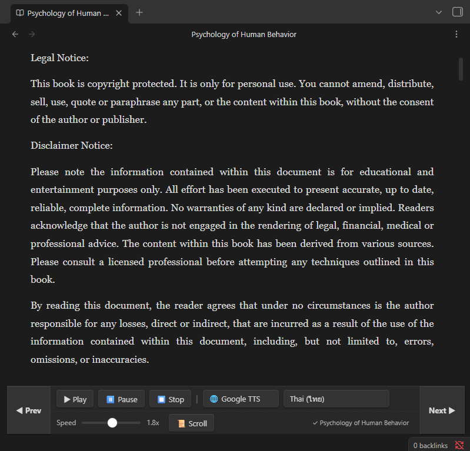

# Obsidian EPUB Reader + TTS

A powerful and fully-featured EPUB reader plugin for Obsidian that brings your books to life with advanced Text-to-Speech (TTS) integration, immersive reading modes, and intelligent sentence tracking.

## ✨ Features

### 📖 Immersive EPUB Reading
- **Native Rendering:** Open and read any `.epub` file directly inside Obsidian.
- **Scroll vs. Page Mode:** Seamlessly toggle between continuous vertical scrolling or comfortable per-chapter pagination.
- **Smart Page Turning:** Use the **Prev** and **Next** buttons to flip pages (scroll by exactly one screen height). If you reach the end of a chapter, it intelligently jumps to the next one!

### 🗣️ Advanced Text-to-Speech (TTS)
- **Dual TTS Engines:**
  - **System TTS:** Uses your operating system's native offline voices.
  - **Google TTS:** Uses cloud-based, high-quality voices (with robust support for languages like Thai and many others).
- **Live Text Highlighting:** The text being spoken is dynamically highlighted on the screen and automatically scrolls into view.
- **Start From Cursor:** Click anywhere on a sentence and hit **Play** — the TTS will instantly start reading from where you clicked!
- **On-the-fly Speed Control:** Adjust the reading speed (0.5x to 3.0x) instantly without stopping playback.
- **Smart Paragraph Skipping:** When the TTS is active, clicking **Prev** or **Next** will skip the audio backwards or forwards by one sentence/paragraph, letting you navigate audio without losing context.

### ⚙️ Customizable Interface
- **Toolbar Positioning:** Prefer the controls at the top or bottom of the screen? Go to the plugin settings and move the toolbar to fit your reading style.
- **Automatic State Saving:** Your preferred TTS Engine, Voice, Speed, and Toolbar position are remembered automatically for your next reading session.

---

## 🚀 How to Use

1. **Open an EPUB:** Drag and drop an `.epub` file into your Obsidian vault, and click on it to open the reader.
2. **Start Listening:** Click the **▶ Play** button in the toolbar. The plugin will extract the text, highlight the current sentence, and begin reading.
3. **Select a Starting Point:** If you want to start reading from the middle of the chapter, use your mouse to select or click on the text you want, then press **▶ Play**.
4. **Change TTS Provider:** Use the dropdown in the toolbar to switch between **System TTS** and **Google TTS**. 
   - *Note: Google TTS offers a dedicated language dropdown to select the target language (e.g., Thai (ไทย)).*
5. **Adjust Speed:** Drag the speed slider left or right. The speed updates immediately, even while the audio is playing.
6. **Skip Sentences:** While the audio is playing or paused, press **◀ Prev** or **Next ▶** to jump to the previous or next paragraph.
7. **Change Chapters/Pages:** If you press **⏹ Stop** to exit TTS mode, the **◀ Prev** and **Next ▶** buttons will return to their normal behavior: turning the page or jumping to the next chapter.
8. **Toggle View Mode:** Click the **📜 Scroll / 📄 Page** button to switch between reading a single chapter at a time or the entire book continuously.

---

## 🛠️ Plugin Settings

You can configure the plugin by going to **Obsidian Settings > Community Plugins > EPUB Reader + TTS Settings**:
- **Toolbar Position:** Choose whether the playback controls stick to the **Top** or **Bottom** of the screen. (Note: You may need to close and reopen your EPUB for this to take effect).

---

## ❤️ Support & Donate

If this plugin has improved your Obsidian workflow, saved you time, or you just want to support its continued development, please consider donating! 

Your support is incredibly appreciated, helps fix bugs, and keeps this project alive and growing. 🙏

https://buymeacoffee.com/endofday

---
**Built with ❤️ for the Obsidian Community**
